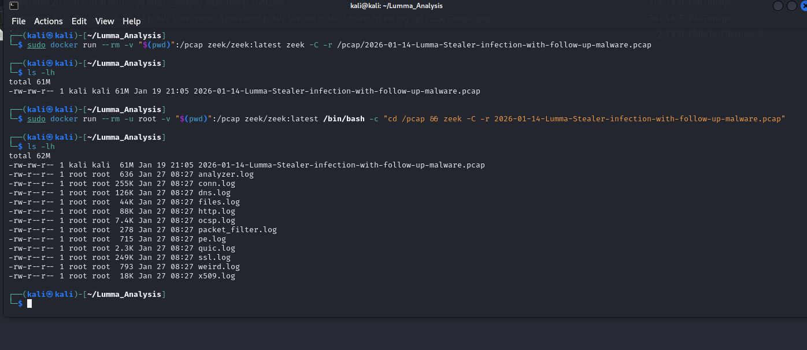
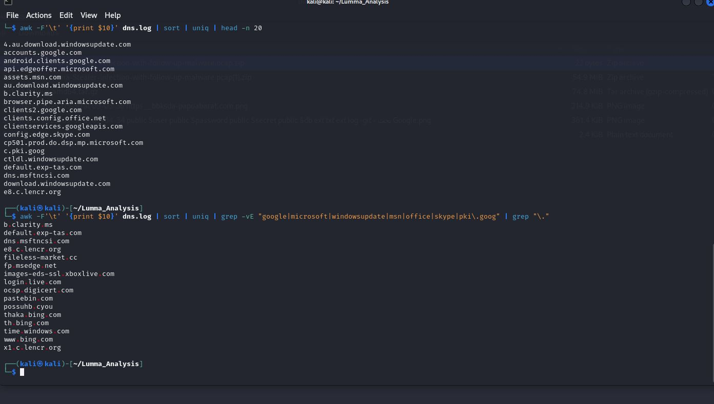
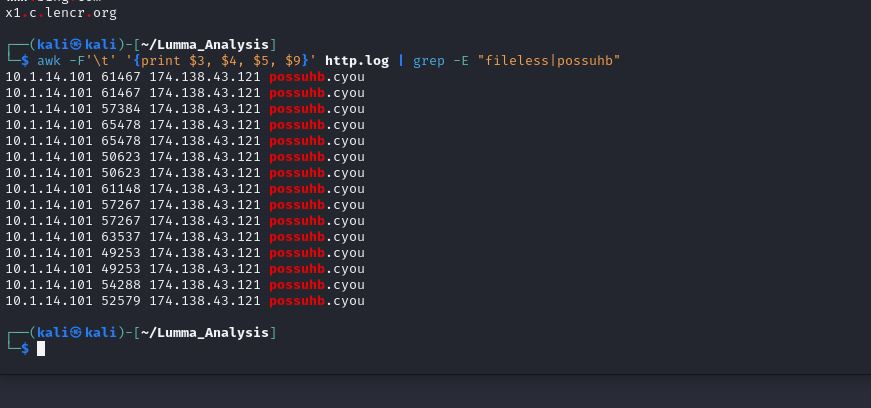
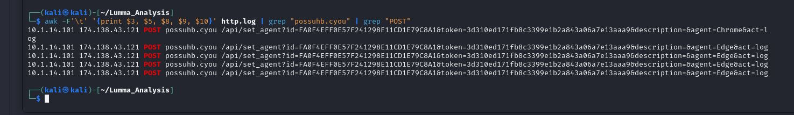

# **Technical Analysis Report: Lumma Stealer Data Exfiltration**

## **1. Executive Summary**
This report details the network forensic investigation of a **Lumma Stealer** malware infection. The objective was to analyze raw network traffic to identify Command & Control (C2) infrastructure, track communication patterns, and confirm data exfiltration.

* **Analysis Tool:** Zeek Network Security Monitor
* **Methodology:** Traffic Analysis & Protocol Inspection
* **Case Status:** Critical - Confirmed Data Exfiltration

---

## **2. Phase I: Environment Setup & Log Generation**
The investigation began by processing raw PCAP artifacts into structured, queryable logs using Zeek. This allows for deep inspection of specific protocols such as DNS and HTTP.

> **Technical Observation:** The generation of `dns.log`, `http.log`, and `conn.log` provides a comprehensive view of the network layer, enabling the isolation of malicious traffic from legitimate noise.

---

## **3. Phase II: C2 Infrastructure Identification**
By analyzing DNS queries, I identified active communication with suspicious Top-Level Domains (TLDs) that are frequently utilized by Lumma Stealer for evasion.

> **Indicator of Compromise (IOC):** The domain **`possuhb.cyou`** was identified as a primary Command & Control (C2) node. The high frequency of lookups to this domain indicates an active infection.

---

## **4. Phase III: Traffic Flow & Beaconing Patterns**
Analyzing the `conn.log` allowed for the identification of the communication flow between the internal victim and the external threat actor.

* **Victim Endpoint:** `10.1.14.101`
* **External Adversary:** `174.138.43.121`

> **Technical Detail:** The logs show persistent TCP connections to the remote IP. The pattern of these connections suggests **Beaconing** activity, where the malware periodically checks in with the C2 server for tasking.

---

## **5. Phase IV: Confirmed Data Exfiltration**
The final stage of analysis confirmed the impact of the attack. Inspection of HTTP traffic revealed the exfiltration of sensitive user data.

> **Deep Packet Inspection (DPI):** The captured **HTTP POST** requests to the `/api/set_agent` endpoint provide definitive proof of data theft. The URI parameters indicate the exfiltration of credentials and session tokens from **Google Chrome** and **Microsoft Edge**. Unique victim IDs and authentication tokens were observed being transmitted to the adversary.

---

## **6. Conclusion & Mitigation**
The analysis confirms a successful deployment of Lumma Stealer with high-impact data exfiltration. 

### **Recommendations:**
1.  **Host Isolation:** Isolate `10.1.14.101` from the production network.
2.  **Network Blocking:** Blacklist IP `174.138.43.121` and block all `.cyou` TLD traffic at the firewall level.
3.  **Credential Reset:** Force a password reset for all browser-synced accounts (Google/Microsoft) associated with the victim machine.

---
## 🛡️ MITRE ATT&CK Mapping & Analysis

To better understand the behavior of **Lumma Stealer**, I mapped the observed activities during the technical investigation to the MITRE ATT&CK Framework.

### Phase 1: Access & Communication

* **Credential Access:** Identified the malware's ability to extract sensitive data from **Web Browsers** (T1555.003).
* **Command and Control:** Observed the use of standard **Web Protocols** (HTTP) for C2 communication and data exfiltration.

### Phase 2: Reconnaissance & Discovery

* **Discovery:** The malware performed **System Information Discovery** (T1082) to gather victim machine specifications, which is a common step before executing further malicious payloads.
