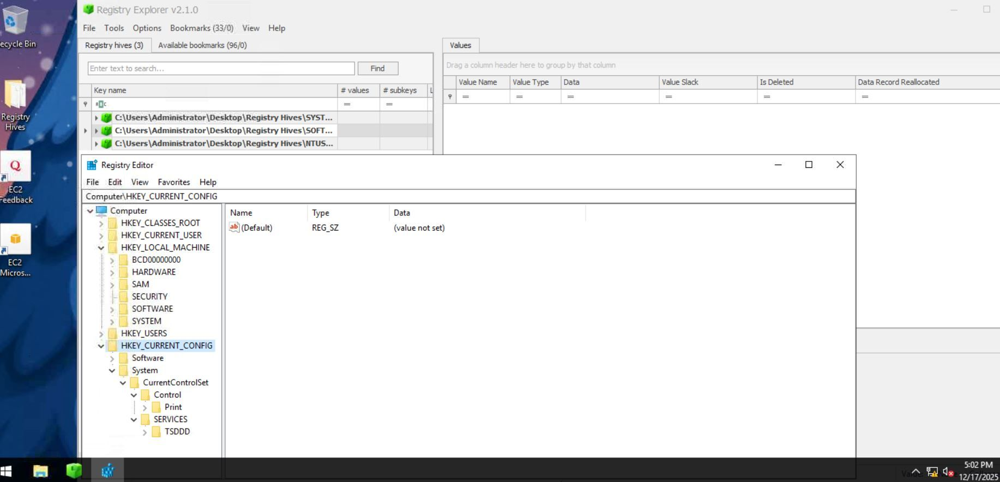
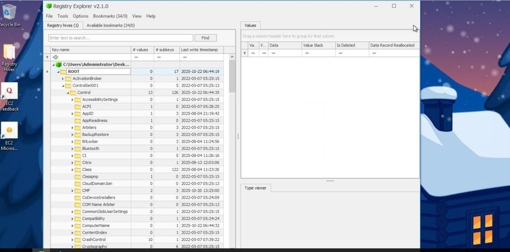
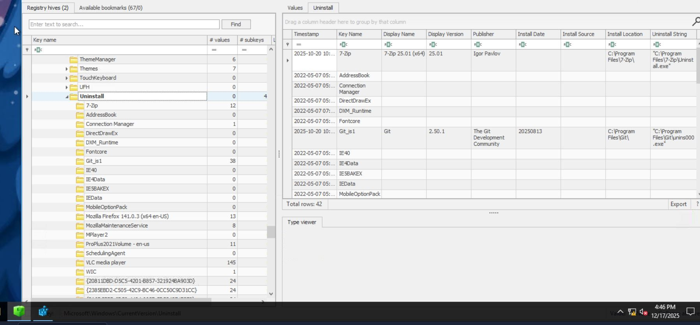
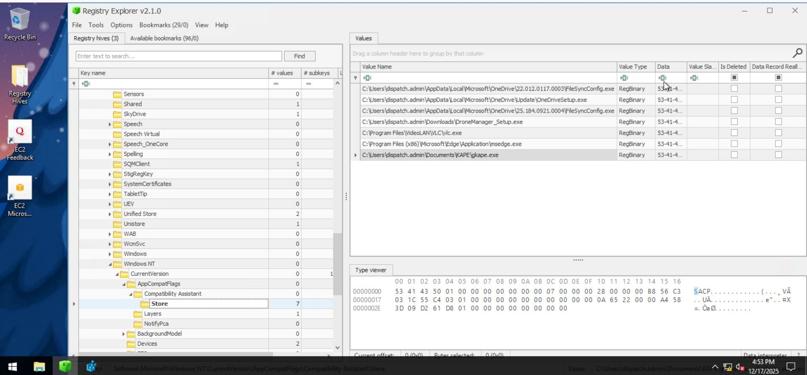
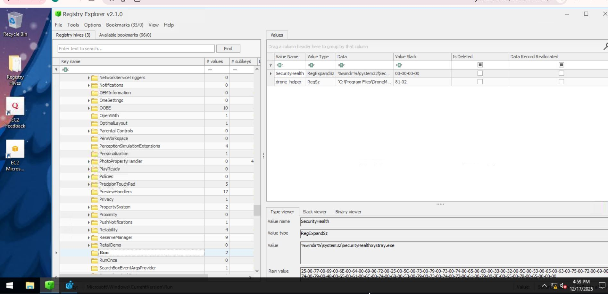

# 🔍 Case Study: Windows Registry Forensics on Compromised Asset (dispatch-srv01)

## 1. Executive Summary
This report documents a forensic investigation of the Windows Registry from the host **dispatch-srv01**. The objective was to identify artifacts of a recent compromise. The analysis focused on identifying installed software, execution paths, and persistence mechanisms.

* **Asset Name:** `dispatch-srv01`
* **Artifacts Analyzed:** `SYSTEM`, `SOFTWARE`, and `NTUSER.DAT` Registry Hives.
* **Key Finding:** Identified unauthorized persistence via the Registry Run key and confirmed execution of a suspicious binary.
* **Impact:** **High** — Persistence established on a critical asset.

---

## 2. Investigation Context & Methodology
The investigation followed a standard offline forensic workflow using **Registry Explorer (Zimmerman Tools)**.

### Hive Loading & Consistency
Registry hives were loaded from `C:\Users\Administrator\Desktop\Registry Hives\`. Transaction logs were replayed to ensure a consistent hive state for analysis.

*Loading and replaying transaction logs for the SYSTEM, SOFTWARE, and NTUSER hives.*

---

## 3. Technical Findings

### 3.1. System Hostname Verification
The system hostname was verified within the `SYSTEM` hive to confirm the identity of the asset under investigation.

*Registry Path: ROOT\ControlSet001\Control\ComputerName\ComputerName showing DISPATCH-SRV01.*

### 3.2. Software Installation Analysis
Examination of the `Uninstall` key revealed recent software installations. 

*Registry Path: HKLM\SOFTWARE\Microsoft\Windows\CurrentVersion\Uninstall.*

### 3.3. Execution Analysis (UserAssist)
Analysis of the `UserAssist` key in the `NTUSER.DAT` hive confirmed the execution of several binaries, including those located in suspicious directories.

*Tracking GUI-based execution of binaries on the compromised host.*

### 3.4. Persistence Mechanism (Run Key)
A critical persistence artifact was identified in the `SOFTWARE` hive. An unauthorized entry was added to the `Run` key to ensure the malicious process starts automatically.

*Registry Path: HKLM\SOFTWARE\Microsoft\Windows\CurrentVersion\Run showing the 'drone_helper' persistence value.*

---

## 4. Analysis & Impact
* **Attack Vector:** The presence of binaries in user-writable directories suggests a direct download or social engineering vector.
* **Persistence:** The use of the `Run` key provides the attacker with reliable persistence upon user login.
* **CIA Impact:** * **Integrity:** Modified system configuration to facilitate malicious activity.
    * **Confidentiality:** Risk of unauthorized access to sensitive administrative data.

---

## 5. Recommendations & Remediation

### Immediate Response
1. **Persistence Removal:** Delete the unauthorized `drone_helper` registry entry and its associated binary.
2. **Host Isolation:** Isolate `dispatch-srv01` for deeper memory and disk forensics.

### Long-term Hardening
1. **EDR Implementation:** Deploy Endpoint Detection and Response (EDR) to monitor for unauthorized Registry modifications.
2. **Least Privilege:** Restrict administrative permissions to prevent unauthorized software installation and Run key modifications.

---
⬅️ [Back to Writeups](../README.md)
