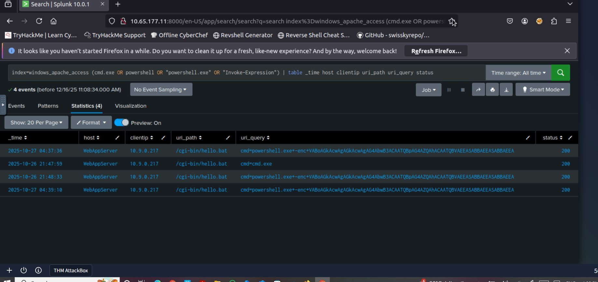
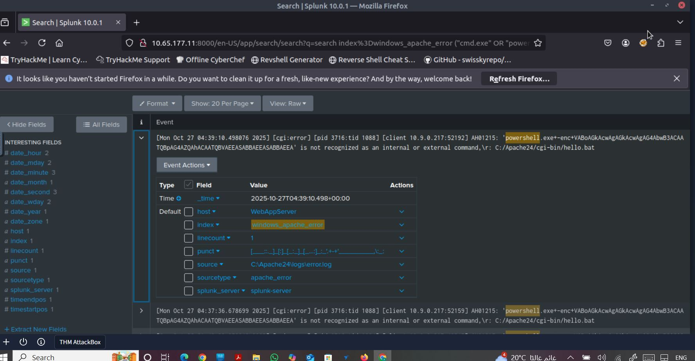
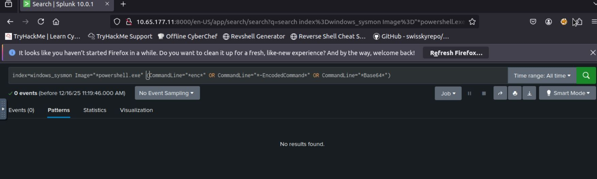
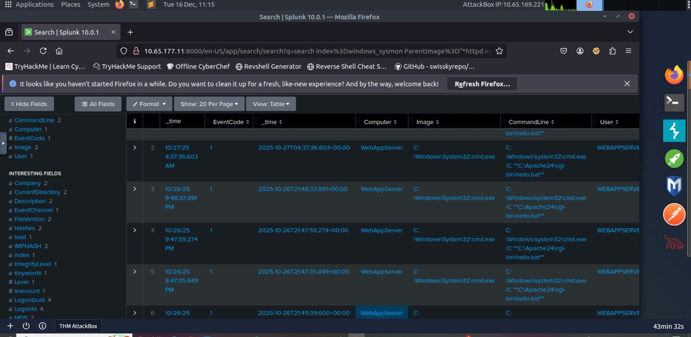
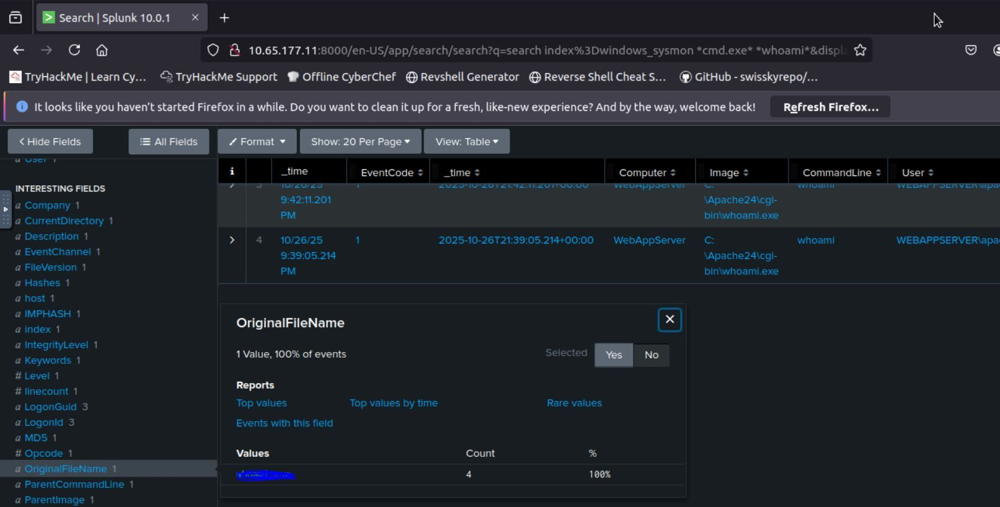

# 🔍 Case Study: Web Attack Forensics via Splunk (Drone Alone)

## 1. Executive Summary
This report documents a forensic investigation into a **Command Injection** attack targeting the TBFC drone scheduler web UI. Using **Splunk SIEM**, Apache web logs were correlated with Windows Sysmon telemetry to identify the attack vector and assess system impact.

* **Asset Name:** WebAppServer
* **Attack Vector:** Exploitation of a vulnerable CGI script (`hello.bat`).
* **Key Finding:** Successful Remote Code Execution (RCE) via PowerShell.
* **Verdict:** **Confirmed True Positive (TP)**.

---

## 2. Investigation Context
* **Platform:** Splunk Enterprise
* **Affected Service:** Apache Web Server (Windows-based)
* **Vulnerable Component:** `/cgi-bin/hello.bat`
* **Tactics (MITRE ATT&CK):** Initial Access (T1190) & Execution (T1059).

---

## 3. Technical Investigation & SPL Queries

### 3.1. Web Layer Triage (Apache Logs)
The investigation started by searching `windows_apache_access` for suspicious command execution strings in URI queries.

*Figure 1: Identifying Base64 encoded PowerShell payloads in URI queries.*

### 3.2. Error Log Confirmation
Analysis of `windows_apache_error` logs confirmed that the server attempted to process the PowerShell commands, flagging unrecognized console output.

*Figure 2: Correlating 404/500 errors and command recognition issues in error logs.*

### 3.3. Searching for Encoded Commands (Sysmon)
A specific query was executed in `windows_sysmon` to find any PowerShell instances running with encoded commands (`-enc`, `-EncodedCommand`, or `Base64`).

*Figure 3: Hunting for obfuscated PowerShell execution in host-level logs.*

### 3.4. Host-Level Correlation (Process Creation)
To confirm RCE, Sysmon logs were queried for instances where the web server process (`httpd.exe`) spawned a system shell (`cmd.exe`).

*Figure 4: Definitive evidence of httpd.exe spawning cmd.exe (EventID 1).*

### 3.5. Post-Exploitation Reconnaissance
The attacker was observed executing the `whoami` command to verify the user context after establishing a foothold.

*Figure 5: Tracking the execution of reconnaissance commands via Sysmon.*

---

## 4. Attack Timeline (Reconstructed)
*Based on Splunk _time field:*

| Time (UTC) | Action | Evidence Source |
| :--- | :--- | :--- |
| **21:45:09** | Initial Recon / Failed injection attempts. | `windows_apache_access` |
| **21:47:35** | Execution of Base64 encoded PowerShell via `hello.bat`. | `windows_apache_access` |
| **21:48:33** | **RCE Achieved:** `httpd.exe` spawned `cmd.exe`. | `windows_sysmon` |
| **04:39:10** | Execution of `whoami` for privilege verification. | `windows_sysmon` |

---

## 5. Analysis and Impact
* **Attack Chain:** The attacker exploited a vulnerable CGI script to execute arbitrary OS commands.
* **CIA Impact:**
    * **Integrity:** High - Unauthorized system commands were executed.
    * **Confidentiality:** Moderate - Risk of sensitive data exposure through reconnaissance.

---

## 6. Recommendations & Mitigation
1. **Immediate:** Disable the vulnerable `hello.bat` script and block the attacker's IP (`10.9.0.217`).
2. **Short-term:** Implement Splunk alerts for any child process of `httpd.exe` that is a shell.
3. **Long-term:** Enforce strict input validation and follow the principle of least privilege.

---
⬅️ [Back to Writeups](../README.md)
